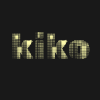

<p align="center">
  
</p>

Kiko is a social robot combining custom SLAM and an expression engine. The SLAM implementation is designed for model hot-swap-vision models improve, and Kiko improves with them. Built entirely in Rust.

**Status:** Early development. Robust SLAM is the primary target.

## Structure

```
kiko/
├── crates/
│   ├── kiko-slam/    # SLAM and feature detection
│   └── oak-sys/      # OAK-D camera FFI bindings
├── comms/
│   ├── robot-server/ # Communication hub (UDP, Serial, HTTP)
│   └── desktop-client/ # Tauri control UI
└── embedded/         # STM32F446 firmware
```

## Immediate Roadmap

- ~~Quick dataset recording~~
- ~~Live match visualisation in Rerun~~
- Hardware-in-the-loop status bar
